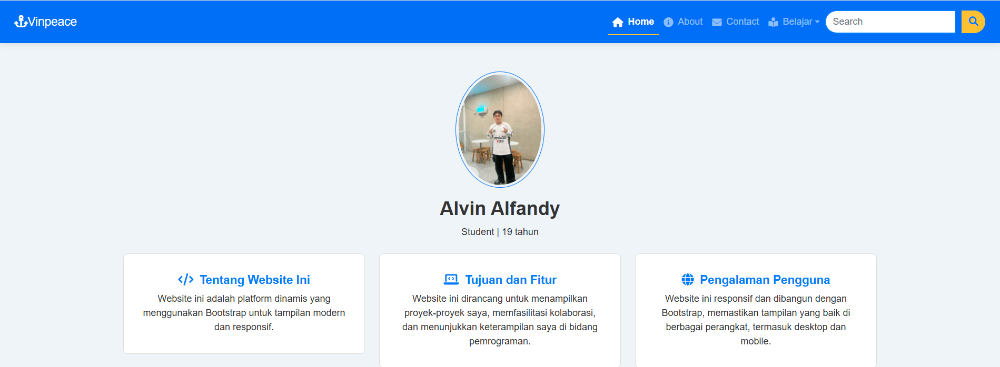
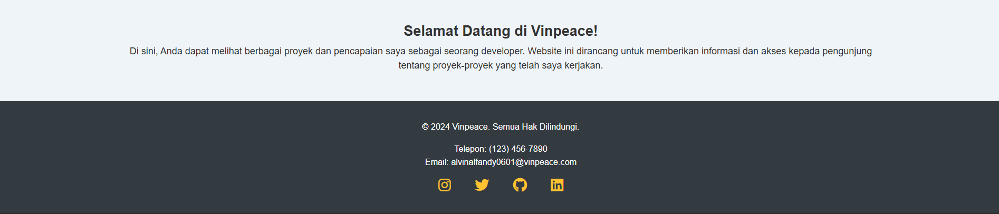
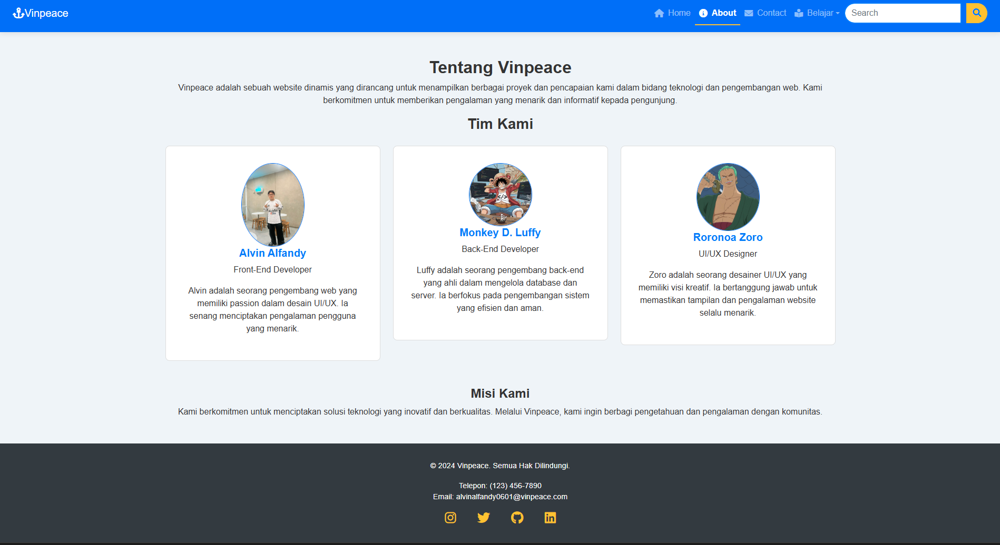
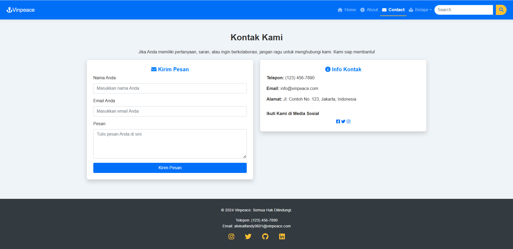
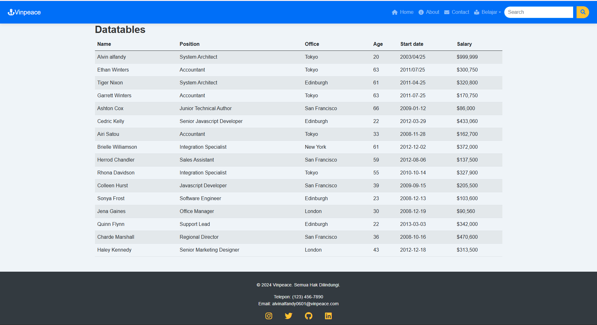
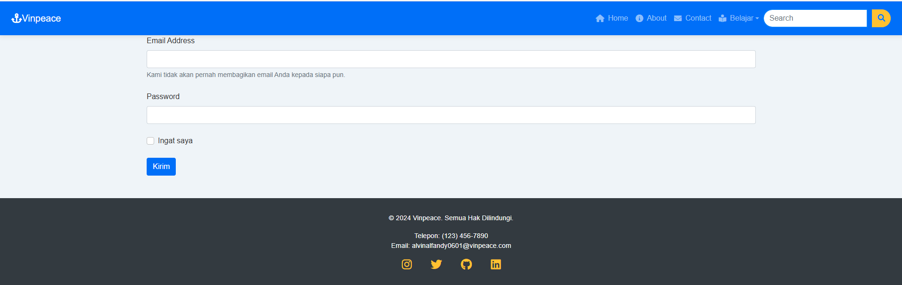

# Dynamic Vinpeace Website

| Detail      | Keterangan      |
| ----------- | --------------- |
| Nama        | ALVIN ALFANDY   |
| Kelas       | TI.23.A5        |
| NIM         | 312310473       |
| Mata Kuliah | PEMROGRAMAN WEB |

## 📑 Deskripsi Project

Website dinamis dengan tema One Piece yang dibangun menggunakan PHP, Bootstrap, dan DataTables. Website ini menampilkan implementasi berbagai fitur web modern seperti responsive design, dynamic routing, dan interactive data tables.

## 🎯 Fitur Interaktif & Navigasi

### 🔝 Navigation Bar

1. **Logo & Brand**

   - Logo One Piece dengan animasi
   - Brand text "Vinpeace" dengan styling custom

2. **Menu Utama**

   - Home (dengan ikon rumah)
   - About (dengan ikon info)
   - Contact (dengan ikon amplop)
   - Dropdown Menu "Belajar":
     - DataTables
     - Another Action

3. **Search Bar**
   - Input field dengan placeholder "Search..."
   - Tombol search dengan ikon
   - Animasi hover pada tombol

### 📱 Responsive Features

- Hamburger menu untuk tampilan mobile
- Collapsible navbar
- Responsive grid system
- Adaptive images

## 📄 Detail Halaman & Fitur

### 1. Home Page (home.php)




#### Hero Section

- Menyambut pengunjung dengan pesan selamat datang.
- Subtitle dengan efek gradient.
- Background dengan overlay semi-transparan.

#### Profile Card

- Foto profile dengan border circular.
- Nama dan deskripsi.
- Tombol social media:
  - GitHub
  - LinkedIn
  - Instagram
- Hover effect pada card.

#### Feature Cards

1. **Responsive Design Card**

   - Ikon mobile.
   - Deskripsi fitur.
   - Hover animation.

2. **Dynamic Tables Card**

   - Ikon table.
   - Deskripsi DataTables.
   - Interactive hover.

3. **Modern UI Card**
   - Ikon brush.
   - Deskripsi UI/UX.
   - Transition effects.

### 2. About Page (about.php)



#### Profile Section

- Gambar profil besar.
- Nama dan title.
- Deskripsi personal.
- Background dengan efek blur.

#### Tim Kami

- Profil Anda sebagai pengelola website.
- Karakter Luffy dan Nami sebagai ikon tambahan.

### 3. Contact Page (contact.php)



#### Contact Form

- Input fields:
  - Name (required)
  - Email (with validation)
  - Message (textarea)
- Submit button dengan hover effect.
- Form validation untuk meningkatkan user experience.

#### Informasi Kontak

- Lokasi dengan ikon.
- Alamat email dengan link.
- Nomor telepon.
- Social media links dengan hover effects:
  - GitHub
  - LinkedIn
  - Instagram

### 4. DataTables Page (datatables.php)



#### Fitur Tabel

- Sorting functionality:
  - Nama
  - Posisi
  - Kantor
  - Usia
  - Tanggal mulai
  - Gaji
- Fungsi pencarian.
- Kontrol pagination.
- Selector entries per page.
- Responsive table layout.

### 5. Registration Form Page (form.php)



#### Struktur Utama

- Container untuk tampilan rapi.
- Grid Bootstrap untuk penataan form.

#### Elemen Form

- **Input Email**: Field input email disertai label "Email address."
- **Input Password**: Field input untuk kata sandi.
- **Checkbox**: Memberikan pilihan untuk pengguna.
- **Tombol Submit**: Tombol berwarna biru untuk mengirimkan data form.

### 6. 404 Page (404.php)


#### Struktur Utama

- Container utama dengan tampilan tengah.
- Gambar logo One Piece dengan animasi.

#### Elemen Utama

- Teks besar "404" dengan animasi glitch.
- Pesan kreatif yang menyatakan halaman tidak ditemukan.
- Tombol "Back to Home" yang mengarahkan kembali ke halaman utama.

## 🎨 Styling Elements

### Skema Warna

```css
:root {
  --primary: #007bff; /* Biru */
  --secondary: #f8f9fa; /* Abu-abu */
  --accent: #ff9800; /* Oranye */
  --dark: #343a40; /* Gelap */
  --light: #ffffff; /* Putih */
}
```
